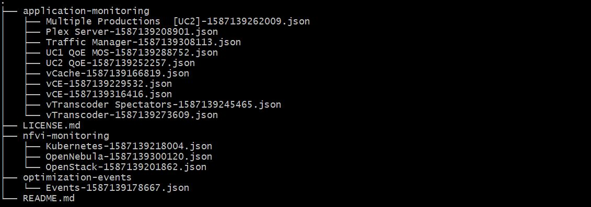

# MAPE Dashboard

This component is part of the 5G-MEDIA MAPE service. Take a look in the [mape](https://github.com/5g-media/mape) repository.

## Introduction

The role of the Dashboard is to visualize the monitoring data from various sources (e.g. NFVIs/infrastrcuture, VNFs, QoEs, etc) across the time. From implementation point of view, the open source tool [Grafana](https://grafana.com/) has been used.

In the frame of the [5G-MEDIA project](http://www.5gmedia.eu/) a set of dashboards were developed. 

## Requirements
- The InfluxDB must be installed, running and accessible from the Grafana


## Installation/Deployment

The official Grafana docker image is used while it is available in the [https://hub.docker.com](https://hub.docker.com/r/grafana/grafana/).

To deploy it as part of the 5G-MEDIA MAPE service, follow the instructions in the [mape](https://github.com/5g-media/mape) repository.

To use it indivindually, firstly download the latest version of the docker image using the command below in the Virtual Machine that will host the container:
```bash
  sudo docker pull grafana/grafana
```

Then, deploy the Grafana as docker container type the following command using a docker volume:
```bash
sudo docker run -d --name=grafana -p 80:3000 -v grafana-storage:/var/lib/grafana grafana/grafana
```

## Configuration

The Grafana retrieves the monitoring data through the InfluxDB server (by default in port 8086). The Grafana has pre-installed the InfluxDB as data source. If not, please install it. After that, you must set the data source (influxDB) in Grafana as follows:

| Parameter | Value |
| --- | --- |
| Data Source Name | InfluxDB |
| Data Source Tame | InfluxDB |
| HTTP URL | http://{your-host}:8086 |
| HTTP Access | Server (Default) |
| InfluxDB Database Name | monitoring |
| InfluxDB User | root (default user in influxdb) |
| InfluxDB User Password| root (default user in influxdb) |

For further details, check [here](http://docs.grafana.org/features/datasources/influxdb/). The repository of the source code is available in [github](https://github.com/grafana/grafana). More details about the installation of the Grafana is available [here](http://docs.grafana.org/installation/docker/).


## Usage

After the deployment and the configuration of the Grafana, you must import the available dashboards.

Three categories of dashboards are provided:
- Dashboards for NFVI monitoring data visualization
- Dashboards for applications monitoring data visualization
- Dashboards for the listing of the optimizations events 




## Tests

Open your browser and type the url `http://{your-host}`. You should access it. After that, press the (default) credentials of the Grafana (admin/admin).

## Authors
- Singular Logic <pathanasoulis@ep.singularlogic.eu>

## Contributors
 - Contact with Authors
 
## Acknowledgements
This project has received funding from the European Union’s Horizon 2020 research and innovation programme under grant agreement *No 761699*. The dissemination of results herein reflects only the author’s view and the European Commission is not responsible for any use that may be made 
of the information it contains.

## License
The 5G-MEDIA dashboards as provided under [Apache 2.0](LICENSE.md) license.


